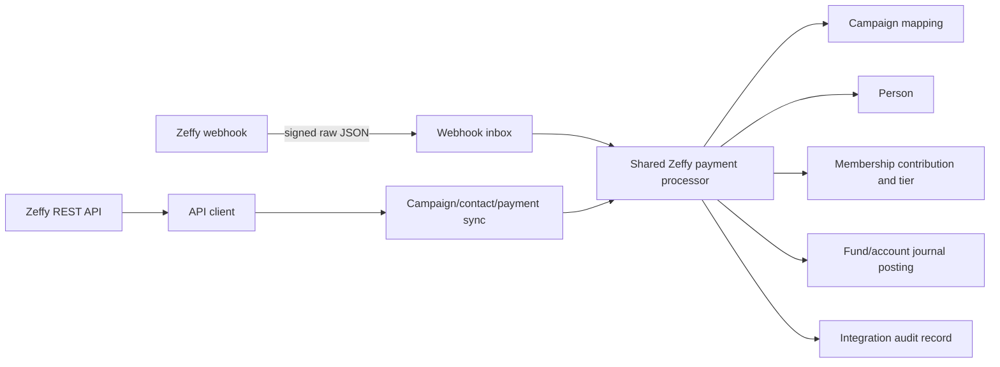

# Zeffy API and Webhook Integration Specification

**Status:** Living specification; Phases 1–4 and Phases 5A–5C implemented
**Date:** September 24, 2026
**Target application:** SVIR ERP, branch `zeffyAPI`
**API contract reviewed:** Zeffy OpenAPI 1.0 supplied as `C:\Users\ZM\Downloads\api-1.json`, plus Zeffy's public API documentation

## 1. Purpose

SVIR ERP will receive Zeffy information directly through authenticated API reads and signed webhook delivery. The former Zeffy Contacts and Transactions spreadsheet imports are removed as part of Phase 1; the unrelated application-owned Member CSV import remains available.

The work is divided into five independently releasable phases:

1. Zeffy connection, campaign synchronization, and mapping
2. Secure webhook inbox
3. Automatic application of completed payments
4. Historical payment synchronization through the API
5. Payment updates/refunds/disputes and contact synchronization

Each phase requires a separate implementation plan and explicit approval before application code is changed. Later phases depend on the acceptance criteria of the earlier phases.

The integration must not create an independent set of church business rules. API synchronization and webhook events must feed shared payment-processing logic so that equivalent Zeffy payments produce equivalent Person, membership, contribution, fund, account, and journal results.

## 2. Goals

The integration will:

- Receive new completed Zeffy payments without waiting for a spreadsheet export.
- Authenticate inbound webhooks using Zeffy's documented signature scheme.
- Keep a durable audit trail of every received event and every Zeffy payment considered by SVIR ERP.
- Prevent duplicate accounting or membership effects across webhook retries, API synchronization, concurrent processing, and reprocessing.
- Synchronize Zeffy campaigns and identify them by immutable Zeffy IDs rather than mutable titles.
- Require an explicit local mapping before a campaign can affect accounting or membership.
- Use the original Zeffy payment date for accounting and membership.
- Support safe operator review and reprocessing when mappings or recoverable data are missing.
- Retrieve historical succeeded payments through the API using cursor pagination.
- Later respond to refunds, disputes, deletions, and contact changes without deleting historical local records.
- Keep credentials encrypted at rest and unavailable to the Angular client.
- Allow staged rollout through disabled, record-only, and live modes.

## 3. Non-goals

Unless a later approved feature expands the scope, the integration will not:

- Host Zeffy checkout forms or collect card details.
- Replace Zeffy's donor-facing receipts, recurring-payment management, campaigns, or ticketing UI.
- Send arbitrary write operations to Zeffy. Contact writes and offline-payment writes exist in the API but are outside this initial five-phase inbound-integration scope.
- Delete local Persons, Members, journal entries, or other historical records because Zeffy deleted a resource.
- Modify manually entered membership contributions or journal entries. Staff deliberately maintain manual contributions, accounting, and membership separately.
- Make Zeffy the master of all Person fields without an explicitly approved field-ownership policy.
- Provide a second Zeffy spreadsheet-ingestion path alongside the API.
- Introduce multi-organization behavior. The application remains one organization per installation.
- Introduce new user roles. Existing authentication remains in effect: operational pages are available to authenticated users and integration credentials/settings are admin-only.

## 4. Zeffy contract

### 4.1 API

- Base URL: `https://api.zeffy.com`
- Authentication: `Authorization: Bearer <API_KEY>`
- The API key is generated by the Zeffy organization owner under Settings → Integrations.
- Reads are available for Payments, Contacts, and Campaigns.
- Payments support list and get operations, as well as write operations for offline payments. This integration uses payment reads only.
- Contacts support list, get, create, update, upsert, and delete. This integration initially uses contact reads only.
- Campaigns support list and get operations.
- List responses use cursor pagination with `has_more` and `next_cursor`.
- `starting_after` requests the next page.
- Page size is 1–100; integrations should request 100 when bulk reading.
- Payment list filters include status, type, currency, contact, campaign, and `created` timestamp ranges.
- Contact list filters include exact email and created/updated timestamp ranges.
- Campaign list filters include created timestamp ranges.
- Limits are shared by the whole Zeffy organization:
  - 100 requests per minute
  - 20 requests per second
- A `429` response includes `Retry-After`. The client must honor it and use bounded retry behavior.
- Authenticated responses may include `X-RateLimit-Limit`, `X-RateLimit-Remaining`, and `X-RateLimit-Reset`.
- SVIR ERP deliberately applies a stricter global pace of one outbound Zeffy request per second. The same shared pacer applies to connection tests, all synchronization types, retries, and future API reads.

### 4.2 Webhooks

The documented event types are:

| Event | Payload data |
|---|---|
| `payment.completed` | Complete Payment object |
| `payment.created` | Complete Payment object, regardless of payment status |
| `payment.updated` | Payment ID reference only |
| `payment.deleted` | Payment ID reference only |
| `contact.created` | Complete Contact object |
| `contact.updated` | Contact ID reference only |
| `contact.deleted` | Contact ID reference only |

Every event contains:

- `id`: UUID identifying the event; unchanged across retries
- `type`: event name
- `version`: integer payload-schema version
- `dispatchedAt`: ISO 8601 timestamp
- `data`: full resource or ID-only reference, depending on event type

Any `2xx` response acknowledges the delivery. A non-2xx response or timeout triggers exponential retries: 12 attempts over as long as three days. Retry times are jittered. Each retry has the same event ID and a new signature timestamp.

### 4.3 Webhook signature

Each request contains:

```text
Zeffy-Signature: t=<unix-seconds>,v1=<hex-signature>
```

Verification must:

1. Read the unmodified raw request body.
2. Parse `t` and `v1` from `Zeffy-Signature`.
3. Compute `HMAC-SHA256(signingSecret, "{t}.{rawBody}")`.
4. Decode/compare signatures using a constant-time comparison.
5. Reject a missing, malformed, or invalid signature.
6. Reject timestamps outside an absolute five-minute tolerance.

The signing secret begins with `whsec_`. Zeffy invalidates the previous secret immediately when the secret is regenerated.

### 4.4 Payment values used by this integration

The Payment object includes:

- `id`: stable Zeffy payment identifier
- `created`: Unix timestamp
- `amount` and `eligible_amount`: integer cents
- `currency`
- `status`
- `type`: `online`, `manual`, or `imported`
- `refund_status`: `none`, `partial`, or `full`
- refunds and dispute details
- contact ID and buyer identity/address
- campaign ID, type, category, and description/title
- line items with type `donation`, `ticket`, or `additional_donation`
- rate IDs/titles and occurrence ID
- payment method, receipt URL, recurring details, Zeffy fund, and metadata

All cent amounts must be converted exactly with `BigDecimal.valueOf(cents, 2)`. Floating-point arithmetic is forbidden for accounting values.

## 5. High-level architecture



The implementation should contain these conceptual components:

- **Zeffy API client:** authenticated HTTPS reads, pagination, timeouts, rate-limit handling, and error translation.
- **Webhook signature verifier:** raw-body HMAC verification and replay-window validation.
- **Webhook inbox:** durable, idempotent event receipt independent from downstream processing.
- **Campaign catalog and mapping:** synced Zeffy campaign snapshots linked to local business decisions.
- **Zeffy payment record:** one durable local integration record per Zeffy payment ID.
- **Shared payment processor:** transactional application into Person, MemberPayment, tier, and Finance records.
- **Historical sync coordinator:** paginated import runs with checkpoints, counts, and resumable audit status.
- **Contact link/sync service:** added in Phase 5 to track stable Zeffy contact IDs independently from email.

Webhook receipt and payment application must be separate transactions. A valid event should be acknowledged after durable receipt; a local mapping or business error must not cause Zeffy to retry an event for three days. Infrastructure failures that prevent durable receipt should return non-2xx so Zeffy retries.

## 6. Configuration

### 6.1 Settings

The existing `app_setting` and `SettingEncryptor` mechanism will store:

| Setting | Type | Purpose |
|---|---|---|
| `zeffy.api-key` | `SECRET` | Bearer key used for Zeffy API requests |
| `zeffy.webhook-signing-secret` | `SECRET` | `whsec_...` key used for webhook verification |
| `zeffy.integration-mode` | `STRING` | `DISABLED`, `RECORD_ONLY`, or `LIVE` event-processing mode |

Synchronization timestamps, counts, checkpoints, outcomes, and errors are operational history. They must be stored in `zeffy_sync_run`, never in `app_setting`.

The Zeffy API base URL is a server-side constant, not an editable production setting. Tests may inject a mock base URL.

Secret values must:

- Require the application's existing encryption key and salt.
- Never be returned to the UI, even as ciphertext.
- Be represented by `hasValue` only.
- Never appear in logs, exception messages, audit payloads, URLs, or browser storage.
- Take effect on the next request without an application restart.

### 6.2 Integration modes

- **DISABLED:** no webhook event processing. Admin-initiated connection tests and API synchronization remain available so a new installation can be configured and populated before event processing is enabled. The webhook URL must not be configured in Zeffy while the endpoint is deliberately disabled, because non-2xx responses create retries.
- **RECORD_ONLY:** signed webhooks are recorded and displayed but do not create domain records. This is the required initial production mode for Phase 2.
- **LIVE:** supported events are recorded and eligible completed payments are applied automatically.

Mode changes are admin-only and must be audit-visible through normal setting timestamps. Moving to LIVE requires a configured API key, webhook secret, successful connection test, and completed campaign mappings for active campaigns expected to receive payments.

### 6.3 Settings UI

Settings → Zeffy will show:

- API key configured/not configured
- Webhook secret configured/not configured
- Integration mode
- Webhook URL: `{origin}/api/webhooks/zeffy`
- Result of the current-session API connection test; connection tests are not persisted as settings
- Latest campaign synchronization and result counts, derived from `zeffy_sync_run`
- Paginated synchronization history, including failures
- Latest historical payment synchronization and result counts when Phase 4 is implemented
- Buttons for Test Connection and Sync Campaigns
- Clear warnings before secret replacement or mode change

Only the local admin can view or change this page. Operational payment/mapping pages follow the application's existing authenticated-user access model unless role requirements change later.

## 7. Persistence model

Exact names can be adjusted to repository conventions, but the following data responsibilities and constraints are required.

All integration records implicitly belong to the installation's single organization. They do not store an organization foreign key, and internal endpoints do not accept an organization ID.

### 7.1 Zeffy campaign

Stores the most recent API snapshot of a campaign:

- local UUID
- globally unique Zeffy campaign ID within the installation
- title
- campaign type and category
- status, archived/deleted indicators
- currency
- created/updated timestamps from Zeffy when supplied
- last synchronized timestamp
- selected raw metadata needed for diagnostics; not an unrestricted duplicate of the entire response

Campaign synchronization updates descriptive fields but never silently changes local mappings.

### 7.2 Campaign mapping

Campaign policy is stored with the synchronized `zeffy_campaign` record. The immutable Zeffy campaign ID is authoritative; title is descriptive and may change.

Required local policy:

- local Fund
- required income category Account when action is `APPLY`
- membership-credit flag
- processing action: `APPLY` or `IGNORE`
- optional explanatory note

Every policy must be explicitly confirmed by an operator before automatic processing. Suggestions derived from Zeffy type/category have no effect until confirmed. A rename updates descriptive fields without changing confirmed local policy.

### 7.3 Synchronization run

`zeffy_sync_run` stores every manual or scheduled synchronization attempt:

- run ID and synchronization type: `CAMPAIGNS`, `PAYMENTS`, or `CONTACTS`
- status: `RUNNING`, `COMPLETED`, `PARTIAL`, or `FAILED`
- trigger type and initiating user when available
- start and completion timestamps
- requested time range and starting/ending cursor where applicable
- fetched, inserted, updated, ignored, and failed counts
- sanitized/truncated error summary

A run is inserted and committed before the first remote request. Completion or failure is committed independently so a remote or processing exception does not erase the audit record. Settings/status views derive the latest result from this history.

### 7.4 Webhook event

Stores one row per Zeffy event ID:

- local UUID
- unique Zeffy event ID
- event type and schema version
- dispatched timestamp
- signature timestamp
- raw JSON payload (`LONGTEXT`)
- receipt timestamp
- status: `RECEIVED`, `PROCESSING`, `PROCESSED`, `NEEDS_MAPPING`, `NEEDS_REVIEW`, `ERROR`, `IGNORED`, or `UNSUPPORTED`
- attempt count, last attempted time, processed time
- safe/truncated operator-facing error message
- Zeffy payment/contact ID when known
- links to the Zeffy payment record and created local records where appropriate

Raw payload contains personal information. It must not be included in routine list responses or logs. A sanitized/detail endpoint may expose it only to the admin if operationally necessary.

### 7.5 Zeffy payment record

Stores one row per unique Zeffy payment ID, independent of webhook event IDs:

- unique `zeffy_payment_id` constraint
- latest Zeffy status, refund status, dispute status, amount, eligible amount, currency, and created timestamp
- payment type, campaign ID/title snapshot, contact ID, buyer email/name snapshot
- latest payload snapshot or controlled raw JSON
- processing status and error/review reason
- first-seen source: `WEBHOOK` or `API_SYNC`
- first/last event and synchronization timestamps
- links to Person, Member, MemberPayment, JournalEntry, and any later reversal/correction entries

This is the business idempotency boundary. A new event may update the record, but only one initial application may create the original domain effects.

### 7.6 Payment lifecycle audit (Phase 5A)

`zeffy_payment_change` stores one immutable-current snapshot per lifecycle webhook event, including the change kind, normalized fields that changed, previous/current payload hashes, the fetched payment snapshot, an operator summary, and the event observation time. The snapshot is retained for recovery and audit but is not returned by the routine UI API.

`zeffy_refund` and `zeffy_dispute` store stable external IDs, amount/currency/status, Zeffy creation time, the latest webhook that observed the record, and correction state. The nullable correction JournalEntry link is populated only by Phase 5B. Reprocessing the same event or observing the same refund/dispute again updates the existing record rather than creating a duplicate.

### 7.7 Contact synchronization record (Phase 5C)

`zeffy_contact` stores one row per unique Zeffy contact ID and links it to the resolved Person. It retains the latest normalized contact details, contribution aggregate, donation count and dates, payload hash, processing outcome, first-seen source, synchronization timestamps, latest webhook, and deletion tombstone. Email remains a matching aid but is not the durable external identity because an email can change.

## 8. Cross-cutting business rules

### 8.1 Authority and identity

- Zeffy IDs are authoritative external identifiers.
- Webhook event ID deduplicates deliveries; payment ID deduplicates business effects.
- Campaign titles and email addresses are not stable external identifiers.
- Existing Persons are initially matched by normalized email when no Zeffy contact link exists.
- Email comparison should trim surrounding whitespace and compare case-insensitively.
- The integration must not merge two existing Persons automatically.
- An email conflict or ambiguous match produces `NEEDS_REVIEW` with no domain writes.
- New Persons use buyer/contact values present in Zeffy. Existing nonblank local contact values are preserved unless Phase 5 establishes explicit field ownership.
- Deleting a Zeffy contact never deletes a local Person.

### 8.2 Campaign policy

- Synced Zeffy category/type is descriptive and may provide a suggested default.
- Local campaign mapping is authoritative for Fund, income Account, membership credit, and ignore/apply behavior.
- A payment with no active mapping is recorded as `NEEDS_MAPPING` and creates no Person, MemberPayment, or JournalEntry.
- Mapping changes affect unprocessed/reprocessed records. They do not silently rewrite already-posted accounting.
- Correcting an applied payment requires an explicit correction/reversal operation and an audit link.
- Campaign type/category suggestions remain advisory until the operator confirms policy.

### 8.3 Payment eligibility

- Only `payment.completed` events with `data.status == succeeded`, or API payments explicitly returned with `status=succeeded`, are eligible for initial application.
- `payment.created` is recorded but does not create financial or membership effects.
- A zero-dollar succeeded payment may create membership/contact effects when its campaign mapping grants membership credit, but creates no JournalEntry.
- Negative amounts are invalid for initial payment application and require review.
- The first implementation supports USD. A non-USD payment is recorded as `NEEDS_REVIEW` until the application has an approved multi-currency policy.
- Payment date is derived from Zeffy's `created` Unix timestamp and converted to the church's `America/Chicago` calendar date.
- Processing/reprocessing date must never replace the original payment date.
- The API `amount` is assumed to be the amount retained by the organization and excludes any donor tip paid to Zeffy. This must be verified against a real organization payload before LIVE mode.

### 8.4 Multi-item payments

One Payment can contain multiple line items. The initial rule is:

- A single campaign mapping governs the full payment because the Payment object has one `campaign_id`.
- Line items are retained in the integration payload/audit for later reporting.
- The full payment amount posts once; individual items must not each post the full payment.
- If future payloads demonstrate that one payment requires different local Funds/accounts for different line items, the record becomes `NEEDS_REVIEW` until a split-allocation feature is approved.
- The sum and meaning of item amounts versus payment amount must be validated using real payload examples before LIVE mode. Discount/additional-donation behavior must not be guessed.

### 8.5 Accounting

- Positive applied payments debit `1020 Undeposited Funds – Zeffy`.
- The credit Account comes from campaign mapping or an approved mapping default.
- The mapped Fund must be attached consistently to the JournalEntry and relevant JournalLines so fund-filtered reports agree with organization reports.
- Journal description includes Zeffy payment ID and campaign title without exposing unnecessary donor data.
- Payment method is `zeffy`.
- Posted journal entries are not edited or deleted. Corrections use linked reversing/reclassification entries.
- No Zeffy platform or processing fee is booked unless Zeffy supplies a real organization-borne fee in a later API version. Zeffy's donor tip is not church revenue.
- Manual contributions and manual journal entries remain separate; the integration only synchronizes records it owns.

### 8.6 Membership

- Campaign mapping decides whether a payment grants membership credit.
- A `donation_form` campaign may suggest membership credit; ticketing campaigns default to no membership credit. The operator must confirm every policy before LIVE processing.
- A membership-credit payment finds or creates the Person and Follower Member, creates a completed `MemberPayment`, and recomputes the tier.
- Non-membership payments do not create Member or MemberPayment records.
- MemberPayment amount and date use the Zeffy payment amount and original date.
- `transactionRef` contains the Zeffy payment ID; the integration payment record remains the stronger uniqueness guarantee.
- Membership period rules are:
  - each individual payment of at least $150 creates one membership year;
  - at least $1,000 selects Benefactor, otherwise Member;
  - a same-tier renewal received during an active period chains from the existing paid-through date;
  - renewals after lapse start from the new payment date;
  - a lower-tier payment made while a higher tier is active is queued after the active tier expires and cannot downgrade it early;
  - a higher-tier payment takes effect immediately and expires one year after the prior paid-through date;
  - payment periods are stored on the integration-owned `MemberPayment` rows so a queued lower tier can take effect after a higher tier expires;
  - lapsed Members/Benefactors retain tier and become inactive;
  - sub-$150 payment history yields an active, nonexpiring Follower and never shortens an unexpired paid tier.
- Free Followers created without a payment remain active until explicitly changed. Recompute All must preserve this confirmed rule.
- A later phase must explicitly decide whether automated recomputation preserves a manually suspended status.
- Manual MemberPayment changes intentionally do not synchronize accounting or trigger automatic tier recomputation.

### 8.7 Acknowledgment and retry rules

- Missing/unconfigured webhook secret: `503` so delivery may be retried while configuration is repaired.
- Missing, malformed, stale, or incorrect signature: `400` and no payload persistence.
- Valid signature but unsupported event type/version: durably record as `UNSUPPORTED`, then return `2xx`.
- Valid duplicate event ID: return `2xx` without reapplying.
- Valid event durably recorded but blocked by mapping/business data: return `2xx`; local status handles recovery.
- Database/infrastructure failure before durable receipt: return `5xx` so Zeffy retries.
- No response should disclose whether a secret fragment was correct.

### 8.8 Concurrency and transactions

- Unique constraints must enforce event-ID and payment-ID idempotency.
- Processing must acquire a row lock or use an atomic status transition so two workers cannot apply the same payment.
- Person, membership contribution, tier change, accounting entry, and integration links for one initial payment must commit atomically.
- A failure rolls back all domain effects for that payment while retaining or updating the separate inbox record.
- Event processing and historical synchronization must call the same payment processor.

## 9. Phase 1 — Connection, campaigns, and mappings

### 9.1 Functional behavior

Phase 1 adds the API foundation without receiving or applying payments.

An admin can:

- Save/replace the encrypted API key.
- Save the encrypted webhook signing secret in preparation for Phase 2.
- Test the API connection using a minimal authenticated read.
- Synchronize all campaigns using `limit=100` and cursor pagination.
- See every synchronization attempt and its status, timestamps, initiating user, and fetched/inserted/updated/ignored/failed counts.
- Review campaigns and configure Fund, income Account, membership-credit flag, and APPLY/IGNORE action.
- See suggested mappings derived from Zeffy campaign type, clearly marked as suggestions until saved.
- Use the immutable Zeffy campaign ID as policy identity; campaign title changes do not affect policy.

### 9.2 API behavior

Phase 1 internal endpoints:

- `GET /api/settings/zeffy/status`
- `PUT /api/settings/zeffy/configuration`
- `POST /api/settings/zeffy/test-connection`
- `POST /api/settings/zeffy/sync-campaigns`
- `GET /api/settings/zeffy/sync-runs`
- `GET /api/zeffy-campaigns`
- `PUT /api/zeffy-campaigns/{campaignId}/mapping`

Settings endpoints are admin-only. Dedicated request/response DTOs prevent secret exposure and keep validation explicit.

### 9.3 Failure handling

- `401`: display “API key rejected”; retain the old stored key if replacing a key and validation was requested before save.
- `429`: honor `Retry-After`; show a retryable error without busy-looping.
- Network/5xx: bounded retry for idempotent GET requests, then show failure.
- A failed synchronization does not delete or invalidate previously synced campaigns/mappings.
- Every attempted synchronization reaches a durable `COMPLETED`, `PARTIAL`, or `FAILED` run status unless the database itself is unavailable.
- A campaign absent from one sync is not immediately deleted locally. Use Zeffy's archived/deleted fields when available and preserve mapping history.

### 9.4 Acceptance criteria

- Secrets are encrypted/redacted.
- Correct API key succeeds; incorrect key produces a clear admin-only error.
- More than 100 campaigns synchronize across pages without duplicates.
- Repeated synchronization is idempotent.
- Campaign rename updates display text without losing the local mapping.
- Campaign synchronization history includes successful, partial, and failed runs and is not stored in `app_setting`.
- The former Zeffy Contacts and Transactions spreadsheet-import code and tables are removed.
- No Person, MemberPayment, or JournalEntry is created in Phase 1.

## 10. Phase 2 — Secure webhook inbox

### 10.1 Functional behavior

Phase 2 adds `POST /api/webhooks/zeffy` and runs in RECORD_ONLY mode initially. The production URL is `https://svirerp.svivanrilski.com/api/webhooks/zeffy`.

The endpoint:

1. Reads raw bytes/string without re-serialization.
2. Verifies timestamp and signature.
3. Parses the minimal event envelope.
4. Inserts the event using the Zeffy event ID unique constraint.
5. Returns `2xx` after the record is durable.

The Finance → Zeffy area will display webhook events with filters for type, status, payment ID, and received date. It will not expose raw payloads in the list.

The implemented receiver limits bodies to 1 MiB. `DISABLED` or a missing signing secret returns `503`; signature/envelope failures return `400`; oversized bodies return `413`; a durable new or duplicate receipt returns `200`. Raw payloads are retained for recovery and later processing phases but have no application UI or API exposure in Phase 2.

### 10.2 Security configuration

- Permit unauthenticated access only to the exact Zeffy webhook route.
- Exempt only that route from browser CSRF protection.
- Authenticate the request exclusively through `Zeffy-Signature`.
- Apply a reasonable request-size limit.
- Never trust forwarding headers or request parameters as proof of Zeffy origin.
- Do not use the outbound API Bearer key to authenticate inbound webhooks.

### 10.3 Acceptance criteria

- Valid signatures within tolerance are accepted.
- Invalid, missing, malformed, future-dated, and stale signatures are rejected.
- Verification uses the original body and constant-time comparison.
- The same event ID delivered repeatedly creates one row and returns success.
- Concurrent duplicate deliveries create one row.
- All seven documented event envelopes can be recorded.
- Unknown version/type is retained as unsupported without domain writes.
- RECORD_ONLY mode cannot create Person, membership, or finance records.

## 11. Phase 3 — Apply completed payments

Implementation: migration V56 and the LIVE processing path implement this phase. LIVE activation
requires configured credentials, a successful connection check, synchronized campaigns, and
confirmed policies for every current non-archived campaign. Historical API ingestion remains Phase 4.

### 11.1 Functional behavior

When mode is LIVE, a supported `payment.completed` event is passed to the shared processor after receipt. Processing outcomes are:

- `PROCESSED`
- `NEEDS_MAPPING`
- `NEEDS_REVIEW`
- `ERROR`
- `IGNORED`

An operator can view the payment, mapping decision, linked local records, error/review reason, and safely request reprocessing after resolving the cause.

### 11.2 Processing sequence

1. Verify event version and type.
2. Upsert the Zeffy payment record by payment ID.
3. If already applied, link the event and stop successfully.
4. Validate succeeded status, USD currency, nonnegative amount, original timestamp, buyer identity, and campaign ID.
5. Resolve the campaign mapping.
6. Resolve/create Person if required.
7. When membership credit is enabled, resolve/create Member and create MemberPayment.
8. For positive amount, create and post the balanced journal entry.
9. Recompute tier for integration-owned membership credit.
10. Link every created record and mark the payment/event processed in the same application transaction.

### 11.3 Review and reprocess

- Reprocess never bypasses signature validation for the original event; it operates on the stored verified payload or refetches by payment ID where appropriate.
- Reprocess uses original payment date and current mapping.
- Reprocess is an idempotent no-op when the payment is already applied.
- Operators cannot edit provider amount/ID in the UI.
- Changing a mapping after a payment was applied does not automatically recategorize it; a separate explicit correction action is required.

### 11.4 Acceptance criteria

- One completed payment produces at most one original journal entry and one integration-owned MemberPayment.
- Webhook retry, manual reprocess, concurrent requests, and later API sync do not duplicate effects.
- Unmapped payment creates no partial domain records.
- Fund tags appear correctly in fund-filtered reports.
- Zero payment follows membership mapping but creates no journal entry.
- Processing date cannot alter payment/membership date.
- Contact data fills blank fields without overwriting existing nonblank values.
- A missing/ambiguous person identity produces review state without partial writes.

## 12. Phase 4 — Historical API synchronization

Implementation: migration V57 and the admin historical-payment workflow implement this phase. The
workflow uses the same API key, global one-request-per-second pacer, campaign mappings, identity
rules, and payment application transaction as live webhook processing. It introduces no CSV or
spreadsheet fallback and no additional secret or application setting.

### 12.1 Functional behavior

An admin can start a historical sync with a required created-from date and optional created-through date. The sync requests:

- `GET /api/v1/payments`
- `status=succeeded`
- `created[gte]` and optional `created[lte]`
- `limit=100`
- cursor pagination through `starting_after`

Every Payment goes through the same upsert and processing pipeline as Phase 3.

### 12.2 Preview and execution

Before application, the first production historical run should support a preview/record-only pass showing:

- total fetched
- already known/applied
- unmapped campaigns
- missing/ambiguous identities
- unsupported currencies/data
- eligible to apply

Execution can then apply eligible records. A partial failure records the cursor and per-payment outcomes. Re-running the same date range is safe because payment IDs are unique.

The admin workflow is exposed under Settings > Zeffy and through these admin endpoints:

- `POST /api/settings/zeffy/sync-payments` with `mode: PREVIEW`, required `createdFrom`, and optional
  inclusive `createdThrough`
- `POST /api/settings/zeffy/sync-payments` with `mode: APPLY` and the approved `previewRunId`
- `GET /api/settings/zeffy/sync-runs/{runId}/payment-results` for paginated per-payment outcomes

Calendar boundaries are interpreted in `America/Chicago`. A through date includes its final whole
second. If it is omitted, Zeffy's request has no upper date filter. Apply refetches the preview's
same range and compares each payload hash with the stored preview. A new, missing, or changed
payment is recorded as `CHANGED_AFTER_PREVIEW` and is not applied; the admin must run a fresh
preview. Only a successfully completed preview can be applied.

Preview may insert or refresh `zeffy_payment` integration snapshots, but it cannot create or alter a
Person, Member, MemberPayment, JournalEntry, or membership tier. Apply re-evaluates current campaign
mappings and person identity before creating domain records. `zeffy_payment.zeffy_payment_id` remains
the idempotency boundary shared with webhooks, so an already applied payment is reported as
`ALREADY_APPLIED`.

Each API page is fetched with `limit=100` and the shared request pacer. Run counts and the ending
cursor are checkpointed after every page. Each fetched payment has a durable result containing its
outcome and preview hash. An interrupted or failed run remains in history; recovery is a new preview
of the same range, which is safe because applied payment IDs are unique.

### 12.3 API-only ingestion

- Historical Zeffy data is loaded through the API; there is no Zeffy spreadsheet fallback.
- Re-running the same date range is safe because the Zeffy payment ID is the business idempotency key.
- Operational recovery uses a new or resumed API synchronization run with a durable checkpoint and per-payment outcomes.

### 12.4 Acceptance criteria

- Pagination handles multiple pages and honors rate limits.
- Interrupted sync can resume or safely restart without duplicate effects.
- Date boundaries and Chicago date conversion are tested.
- Counts reconcile to stored payment outcomes.
- A webhook arriving during sync cannot duplicate the same payment.
- A clean installation can be populated without spreadsheet uploads.

## 13. Phase 5 — Updates, refunds, disputes, and contacts

Phase 5 is delivered in three bounded parts:

- **Phase 5A — payment lifecycle audit (implemented):** process payment-created, updated, and deleted events; fetch the authoritative current Payment for ID-only updates; retain normalized changes, refunds, disputes, and deletion tombstones; and place material cases in operator review. This phase makes no accounting or membership corrections.
- **Phase 5B — payment corrections (implemented):** post idempotent refund, lost-dispute, and payment-amount corrections using the approved rules below.
- **Phase 5C — contact synchronization (implemented):** maintain stable Zeffy contact records, synchronize Persons/Followers through API and webhook ingestion, and expose Zeffy details on the existing People page.

### 13.1 Payment updates

`payment.updated` carries only the payment ID. The processor must fetch `GET /api/v1/payments/{id}`, update the local snapshot, compare it with the previous version, and choose an outcome.

Supported changes should eventually include:

- payment status change
- partial/full refund
- dispute creation/status change
- amount or eligible-amount change
- contact assignment change
- receipt/fund descriptive changes

No update may directly edit a posted JournalEntry. Financial corrections require linked reversing or reclassification entries dated according to an approved accounting policy.

### 13.2 Approved refund and dispute policy

- Full succeeded refund: create a full reversing journal entry, mark the integration-owned MemberPayment refunded, and recompute the affected membership from remaining completed payments.
- Partial succeeded refund: create a partial reversing journal entry, retain the refund independently, reduce the integration-owned membership contribution to the net retained payment amount, and recompute the affected membership.
- Failed/pending refund: record it but do not reverse accounting until succeeded.
- Dispute opened/`needs_response`: record and alert; do not reverse accounting.
- Dispute lost: automatically create an explicit reversal/correction.
- Dispute won: clear the alert without financial reversal.
- A reversal must retain the original Fund and link to the original journal/payment record.
- Refund and lost-dispute correction entries use the original Zeffy payment date.
- Manual payments/contributions remain outside automatic Zeffy correction logic.
- An increase to an applied payment amount creates a linked adjusting income entry for the difference.
- A decrease to an applied payment amount creates a linked reversing entry for the difference.
- Eligible-amount-only, status, currency, campaign, contact, and deletion changes remain review cases because no automatic reclassification rule has been approved.
- If an already-corrected refund changes amount/status, or an already-corrected lost dispute changes status, the posted correction is preserved and the record returns to `NEEDS_REVIEW`.

Phase 5A records succeeded refunds and lost disputes as `AWAITING_CORRECTION`; Phase 5B is responsible for posting the linked correction exactly once. If cumulative succeeded refunds exceed the original payment, the record becomes `NEEDS_REVIEW` and no correction is posted automatically.

Membership-chain consequences can be significant: reducing or removing an old qualifying payment may change later chained periods. This must have dedicated tests and operator-visible before/after results.

Phase 5B corrections run automatically inside the lifecycle transaction after the authoritative
Payment is fetched. The original posted journal entry is never changed. Each nonzero correction is
a new posted `adjusting` or `reversing` journal entry linked through
`journal_entry.corrects_journal_entry_id`. The correction copies the original accounts, Fund,
payer, category, and Zeffy payment method and uses the original payment date.

After all safe financial corrections for a payment are posted, the integration-owned contribution
is set to the current Zeffy amount less corrected succeeded refunds and corrected lost disputes. A
zero retained amount marks it `refunded`; a positive retained amount remains `completed`. The full
membership timeline is then recomputed. Refund, dispute, and amount-change audit records retain the
correction journal link, correction time, and an operator-facing membership before/after summary.

Finance → Zeffy Webhook Events includes **Apply Pending Corrections** for Phase 5A backlog and
recoverable retries. `POST /api/zeffy-webhook-events/corrections/apply-pending` processes one locked
payment per transaction, uses only local data, makes no Zeffy API calls, and reports applied,
already-corrected, needs-review, and failed counts.

### 13.3 Payment deletion

- `payment.deleted` marks the Zeffy payment tombstoned and creates a review item.
- It never hard-deletes local financial or membership history.
- If the payment was applied, an operator chooses the appropriate correction based on why Zeffy deleted it.
- Fetch returning `404` confirms deletion but does not itself authorize reversal.

### 13.4 Contact synchronization

- `contact.created` contains the full Contact and can be processed directly.
- `contact.updated` carries an ID and requires `GET /api/v1/contacts/{id}`.
- `contact.deleted` tombstones the `zeffy_contact` row and never deletes its Person or membership.
- Stable contact ID is stored in `zeffy_contact` and is used before mutable email during later contact, payment, and membership-rebuild processing.
- Initial resolution uses the existing contact link, then a Person already linked to one of the contact's payments, then a unique normalized email.
- If no match exists and usable name data is present, the synchronization creates a Person. Missing or ambiguous identity data produces `NEEDS_REVIEW` without guessing or merging Persons.
- Every resolved Zeffy contact receives an active Follower baseline with `emailOptIn=true`, including contacts with no payments, only zero-dollar payments, or positive non-membership donations.
- An existing Member or Benefactor tier is preserved. Qualifying membership payments remain responsible for upgrades and membership dates; the aggregate contribution total on the contact is informational and does not grant a tier.
- Existing Persons are enriched only in blank name, email, phone, and address fields.
- Email changes that conflict with another Person require review.
- The supplied Contact schema does not expose an explicit unsubscribe/communication-preference field. The integration must not infer opt-out status from absent fields.
- **Sync Contacts** in Settings calls `POST /api/settings/zeffy/sync-contacts`, reads up to 100 contacts per page, and uses the integration-wide one-request-per-second API pacer. Every run and its cursor/counts are retained in `zeffy_sync_run`; rerunning is idempotent by Zeffy contact ID.
- Contact webhooks and full synchronization use the same application logic. An API `404` for an update is treated as a deletion tombstone.
- The existing **People** page remains the contact operator view. It displays local membership plus linked Zeffy status, aggregate contribution, donation count and contribution dates, with full linked-contact details in the existing person dialog. No separate Finance → Zeffy Contacts page is created.
- Bidirectional ERP-to-Zeffy contact writes require a separate approved specification.

### 13.5 Membership rebuild from synchronized payments

The Members page provides **Rebuild from Zeffy** for a clean installation, recovery, and explicit reconciliation. It operates only on local `zeffy_payment` rows and does not make API calls, consume Zeffy quota, or create accounting entries.

The rebuild:

- selects nondeleted succeeded payments whose current confirmed campaign mapping is `APPLY` with membership credit enabled;
- processes payments by original Zeffy timestamp ascending, with Zeffy payment ID as the deterministic tie-breaker;
- matches an existing linked Person first, then a unique normalized email, and creates a Person only when email and name are sufficient and unambiguous;
- creates a missing active Follower Member with `emailOptIn=true`;
- creates or repairs exactly one completed `MemberPayment` identified by payment method `zeffy` and the Zeffy payment ID;
- recomputes every affected member from their complete completed-payment history and persists each payment's assigned membership period;
- is idempotent when run repeatedly;
- reports scanned, created, updated, recomputed, and needs-review counts;
- leaves ambiguous identity, duplicate contribution, invalid amount/date, and refund-lifecycle cases for review.

The endpoint is `POST /api/members/rebuild-from-zeffy`. A confirmation dialog explains the scope before the operation begins.

### 13.6 Acceptance criteria

- Updated/deleted ID references are fetched or tombstoned correctly.
- Fetch `401`, `404`, `429`, network, and 5xx outcomes are distinguishable and retryable where appropriate.
- Refund application is idempotent by refund ID.
- Lost-dispute application is idempotent by dispute ID.
- Payment amount corrections are idempotent by lifecycle change/event ID.
- Corrections preserve Fund/account attribution and link to originals.
- Partial/full corrections update integration-owned membership contributions and recompute all later periods.
- Re-running pending corrections cannot create another journal entry for a corrected item.
- Contacts are not duplicated when email changes after a stable contact link exists.
- Contact deletion never cascades into church records.

## 14. Internal API and UI requirements

The final feature set should expose:

- Zeffy settings/status page
- synchronized campaign/mapping list
- webhook event list/detail
- payment processing list/detail
- mapping-required and review queues
- reprocess action with current-state validation
- historical sync form and run history
- visible links from Zeffy payment/event to Person, MemberPayment, and JournalEntry

List endpoints must be server-paginated. The existing 200-row preview limitation must not be copied into the new integration UI.

UI statuses need plain descriptions:

- Received
- Waiting for campaign mapping
- Needs review
- Processed
- Ignored
- Error
- Unsupported event version/type

Errors shown to operators should explain the action needed without exposing secrets, SQL/schema details, stack traces, or complete raw personal data.

## 15. Security and privacy

- TLS is mandatory for API and webhook traffic.
- Webhook secret and API key use encrypted SECRET settings.
- Webhook route accepts only signed requests; CORS is irrelevant to server-to-server calls.
- Use the raw request body only for signature verification and durable audit storage.
- Do not log payloads, Authorization headers, signature headers, buyer email/address, or secret values.
- Sanitize external strings before including them in logs or UI messages.
- Apply request timeouts and bounded response-body sizes to API calls.
- Do not automatically follow redirects for authenticated API calls to a different host.
- Raw payload access should be restricted to admin or omitted from UI entirely.
- Retention of raw webhook/payment payloads must be reviewed because they contain donor personal information. A future retention job may redact payloads after the operational recovery window while preserving normalized audit fields.
- Secret rotation should be an explicit admin operation. Because Zeffy invalidates the old webhook secret immediately, the UI should instruct the admin to update SVIR ERP before regenerating/enabling delivery where practical.

## 16. Observability and operations

Record metrics/log summaries without personal data:

- webhook deliveries accepted/rejected/duplicated by type
- signature failures
- processing outcomes and durations
- needs-mapping/review/error counts
- API request outcome/latency and `429` count
- sync run counts and cursors
- oldest unprocessed event

Structured log correlation should use local event/payment UUID and a safely abbreviated Zeffy ID. Audit logs should record admin actions such as secret replacement, connection tests, sync initiation, mapping changes, reprocess actions, and mode changes.

The operational dashboard should highlight:

- invalid/unconfigured credentials
- webhook events not processed after a threshold
- unmapped active campaigns
- historical sync failures
- unsupported event versions
- refund/dispute review items

## 17. Testing strategy

### 17.1 Unit tests

- Signature parsing, HMAC, constant-time comparison path, and five-minute tolerance
- Event envelope/version routing
- cents-to-BigDecimal conversion
- Chicago payment-date conversion
- campaign-policy resolution
- person matching and fill-blank behavior
- membership eligibility and existing tier rules
- API error and rate-limit translation
- pagination cursor handling
- refund/dispute difference calculation

### 17.2 Database integration tests

Use a MySQL/MariaDB-compatible test database for:

- unique event and payment constraints
- concurrent duplicate event delivery
- concurrent webhook/API application of one payment
- atomic rollback across Person/MemberPayment/JournalEntry creation
- status transitions and row locking
- fund/account report attribution
- resume/restart of historical sync
- durable synchronization-run completion and failure history

### 17.3 Controller/security tests

- exact webhook route permit/CSRF exemption
- other webhook-like routes remain protected
- signature error response codes
- admin authorization for settings/sync endpoints
- secret redaction
- request-size handling

### 17.4 Contract fixtures

Check in sanitized JSON fixtures derived from OpenAPI examples and real test-mode deliveries for:

- completed donation
- membership campaign
- ticket/event payment
- zero-dollar payment
- recurring payment
- multiple items/additional donation/discount
- missing buyer email
- partial/full refund
- dispute
- updated/deleted reference event
- contact created/updated/deleted
- unknown event version and unexpected additional fields

DTO parsing should ignore unknown additive fields while validating required fields used by business logic.

### 17.5 Angular tests

- secret status/save workflow
- mapping persistence across reload
- pagination/filtering
- record-only versus live mode warnings
- reprocess button idempotency/disabled state
- historical preview totals
- accessible keyboard operation and error/loading recovery

## 18. Rollout plan

1. Apply Phase 1 migrations and configure/test API key.
2. Synchronize campaigns and confirm each active campaign policy.
3. Deploy Phase 2 in RECORD_ONLY mode.
4. Configure the Zeffy webhook URL and signing secret.
5. Observe real events and build sanitized fixtures; verify amounts, donor tips, IDs, item totals, categories, timestamps, and signature behavior.
6. Validate live Payment IDs, amounts, timestamps, and campaign association against Zeffy.
7. Complete mappings and review all recorded events.
8. Enable Phase 3 LIVE mode for completed payments.
9. Monitor and reconcile against Zeffy daily during an initial observation period.
10. Run Phase 4 historical preview, approve its range, then execute.
11. Deploy Phase 5A lifecycle audit and Phase 5B corrections.
12. Deploy Phase 5C, run **Sync Contacts**, review unresolved contacts on the People page, and enable the contact webhook events in LIVE mode.
13. Continue API/webhook reconciliation until two or more accounting periods confirm completeness.

Rollback from LIVE means changing to RECORD_ONLY. It must stop new domain application without discarding received events. Re-enabling LIVE may process the backlog through explicit operator action after mappings and configuration are verified.

## 19. Assumptions and confirmed decisions

### Confirmed for the existing application

- The installation represents exactly one church organization. Domain and integration records belong to it implicitly; they do not carry organization foreign keys and APIs do not accept organization IDs.
- All authenticated operational users currently share access; Settings is local-admin-only.
- Free Followers remain active until explicitly changed.
- Refund and lost-dispute corrections use the original payment date.
- Partial refunds reduce an integration-owned membership contribution to the net retained amount and trigger tier recomputation.
- Lost disputes create automatic corrections; opened disputes only create review work, and won disputes require no correction.
- Valid new Zeffy contacts create a Person and active free Follower. Email opt-in defaults to true under the organization's confirmed policy.
- Manual membership contributions, accounting records, and membership recalculation are deliberately maintained separately by staff.
- Zeffy Contacts and Transactions spreadsheet imports are removed; the generic Member CSV import remains.
- Synchronization history belongs in `zeffy_sync_run`, not `app_setting`.
- All outbound Zeffy API requests are globally paced at one request per second.
- Phase 2 retains verified raw webhook payloads for recovery without exposing them through the application UI or API. They remain stored until an explicit retention/redaction policy is approved.
- Existing payment tier thresholds and renewal chaining remain in effect.
- Posted accounting corrections use new entries rather than editing posted entries.

### Integration assumptions requiring validation with real Zeffy data

- API Payment ID is stable and globally unique within the Zeffy organization.
- Webhook and API representations of the same payment use the same ID.
- Payment `amount` is the church's amount and excludes Zeffy's optional donor tip.
- One campaign mapping can classify the whole payment.
- API timestamps represent the authoritative transaction time.
- Event schema version `1` is the initial supported version.
- Additional unknown JSON fields are backward-compatible and can be ignored.
- Zeffy API/webhook access is available for the production organization and the organization owner can create/rotate the required credentials.

## 20. Open business decisions

These must be answered before their affected phase is implemented:

1. Should every donation-category campaign grant membership credit, or only campaigns explicitly marked for membership?
2. Should automated payment recomputation preserve a manually suspended membership?
3. Which income Account should each campaign use, and should the mapping always require explicit Account selection?
4. How should payments with multiple materially different line items be allocated if one Fund/account is insufficient?
5. Which Person fields may Zeffy update when local values already exist beyond filling blank values?
6. If application-level raw-payload access is added later, which administrative users may use it?
7. What eventual retention/redaction period should replace Phase 2's indefinite recovery retention?
8. What historical cutoff/range should the first API synchronization use?

## 21. Definition of completion

The overall integration is complete when:

- Credentials and mode can be managed securely.
- Campaigns synchronize and mappings survive rename/reload.
- Webhooks are signature-verified, durably recorded, and event-idempotent.
- Completed payments are payment-idempotent across webhook, API synchronization, and reprocessing.
- Eligible payments produce correct Person, membership, Fund, Account, and balanced journal effects atomically.
- Historical synchronization is paginated, rate-limit-aware, auditable, and restart-safe.
- Approved refund/dispute/contact policies are implemented without deleting history.
- Operators can understand and resolve mapping/review/error states from the UI.
- Security, database concurrency, contract fixtures, and core Angular flows have automated coverage.
- Production reconciliation demonstrates that Zeffy totals and SVIR ERP postings agree for the approved scope.
